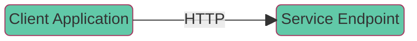
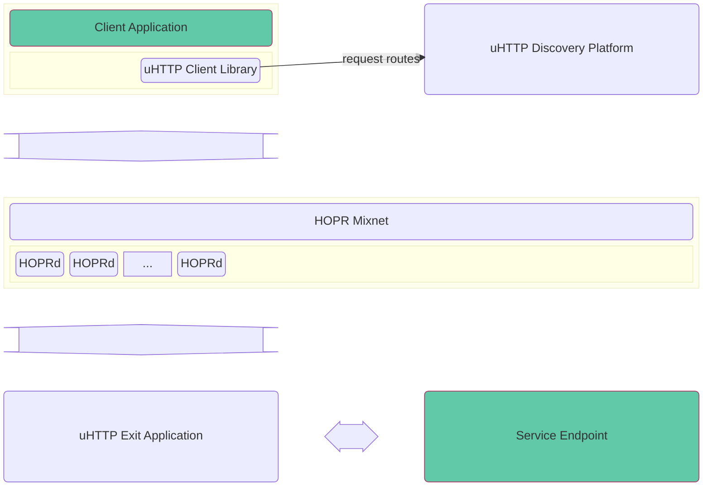
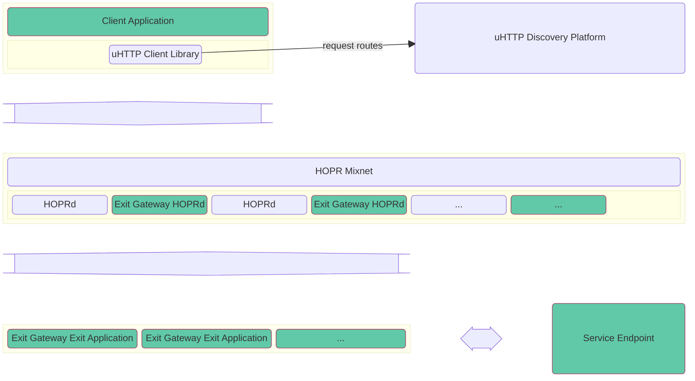
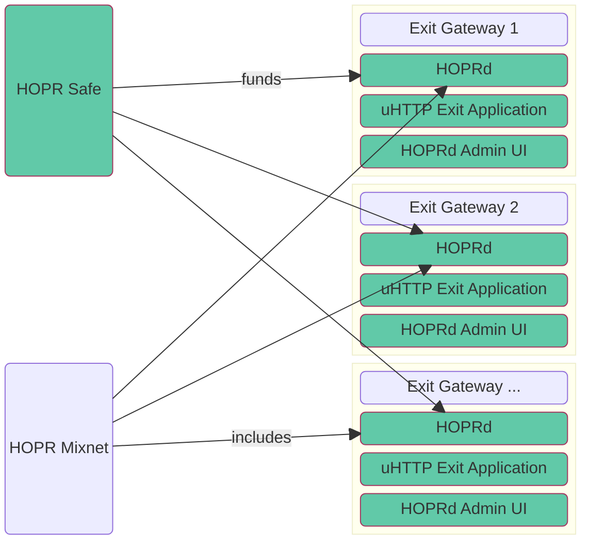

# uHTTP Onboarding

## Motivation

This guide describes how to set up uHTTP with your own exit gateways.
An exit gateway is a combination of a HOPR mixnet node (hoprd) and a uHTTP exit application (exit-app).
Usually, developers can integrate uHTTP by obtaining a client identifier and start sending requests via the uHTTP client library.
This routes requests through HOPR's existing uHTTP infrastructure (HOPR mixnet).
However, for more professional use cases, we recommend hosting your own exit gateways.
The two major advantages of this approach are:

-   Significantly reduced latency
-   Full user privacy (request/response payloads are invisible to uHTTP exit applications)

To benefit from the HOPR mixnet's additional metadata elimination feature, you should run at least three independent exit gateways.

## Overview

A picture is worth a thousand words. Let's show what a typical scenario for a uHTTP enthusiast looks like.

### Typical Application Setup Before uHTTP



Now let's look at a simple uHTTP integration without hosting your own exit gateways.

### Simple uHTTP Integration



This setup is sufficient for testing uHTTP integration, but it is not adequate for a professional setup.
The recommended uHTTP integration involves hosting your own exit gateways.

### Recommended uHTTP Integration



Your exit gateways can be hosted close to your service endpoints.
Let's examine an exit gateway in more detail.

### Exit Gateway



To help you with this setup process, we have identified seven logical steps that will guide you through the onboarding process.

## Step 1: Getting a uHTTP Client ID

If you already have a uHTTP client ID, you can skip this step.

uHTTP currently shares its discovery mechanism with [RPCh](https://rpch.net/).
Go to [Access](https://access.rpch.net/) and use your promo code to create an account.

Notice your secret token. This is your uHTTP client ID. We will need this later.

## Step 2: Creating a HOPR Safe

To securely store your funds while operating a hoprd node, you need to create a HOPR Safe.
Start by visiting the [HOPR staking hub](https://hub.hoprnet.org/) and create a safe connected to your wallet.
Once the safe is set up, you will have a safe address and a module address.
These addresses will be used to manage and distribute funds to your HOPRd nodes.

## Step 3: Obtain a Gnosis RPC Provider

You will need a reliable Gnosis RPC provider for your hoprd nodes.
If you do not yet have one, consider this [guide](https://docs.hoprnet.org/node/start-here#understanding-rpc-importance-and-setting-up-your-own-custom-rpc-provider).

## Step 4: Secrets and Environment Variables

You will need a fair amount of secrets and private-public key pairs to set this all up.
By now, you should already have a HOPR safe address, a HOPR module address, a uHTTP client ID (secret token) and a Gnosis RPC provider URL.

-   [x] uHTTP client ID (secret token)
-   [x] HOPR safe address
-   [x] HOPR module address
-   [x] Gnosis RPC provider

Each exit gateway hoprd:

-   [] Identity/database password (`HOPRD_PASSWORD`)
-   [] API access token (`HOPRD_API_TOKEN`)

Here is a one-liner to generate a secret:

```sh
read -r -n 48 pass < <(LC_ALL=C tr -dc "[:alnum:]" < /dev/urandom); echo "$pass"
```

Each exit gateway exit-app:

-   [x] API access token (`UHTTP_EA_HOPRD_ACCESS_TOKEN` - needs to be identical to `HOPRD_API_TOKEN`)
-   [] Private key (`UHTTP_EA_PRIVATE_KEY`)
-   [] Public key (`UHTTP_EA_PUBLIC_KEY`)

To generate this key pair, clone [uHTTP docker](https://github.com/hoprnet/uhttp-docker) and follow the instructions in `exit-app-create-keypair/README.md`.
You can also generate this key pair later on when setting up the exit application.

## Step 5: Setting Up uHTTP Exit Gateways

### Requirements

While it is theoretically possible to run multiple exit gateways on a single machine, we strongly recommend running each gateway on its own machine.
The minimum hardware requirements are 2GB of RAM and 4 CPU cores.

### Backup

During the setup process, an identity file for HOPRd is generated, which can only be decrypted using your identity password (`HOPRD_PASSWORD`).
We recommend backing up this identity file after the gateway is up and running.
It is located at `hoprd_data/hopr.id`.

### Setup

Each gateway consists of a HOPR node, a HOPRd Admin UI web app, and a uHTTP exit application.
Gateways should be hosted on different IPs.
The process to set up a single gateway is as follows:

Log in to your gateway's machine and clone the [uHTTP docker](https://github.com/hoprnet/uhttp-docker) repository.

This repo contains the Docker Compose file that specifies the three services.
For your gateway node to run correctly, ensure that you have the HOPRd P2P port (9091/tcp/udp) open.
Then follow these instructions:

-   Copy `.env.sample` to `.env` -- values can be left untouched.
-   Copy `.env-secrets.sample` to `.env-secrets`.
-   In `.env-secrets`, replace the placeholder for `HOPRD_PASSWORD` with the generated value from Step 4.
-   In `.env-secrets`, replace the placeholder for `HOPRD_API_TOKEN` with the generated value from Step 4.
-   In `.env-secrets`, replace the placeholder for `UHTTP_EA_HOPRD_ACCESS_TOKEN` with the same value as `HOPRD_API_TOKEN`.
-   In `.env-secrets`, replace the placeholder for `UHTTP_EA_PRIVATE_KEY` with the generated private key.
-   In `.env-secrets`, replace the placeholder for `UHTTP_EA_PUBLIC_KEY` with the generated public key.
-   Open `hoprd_data/hoprd.cfg.yaml` and update the sections in curly brackets:
    -   `hopr.host.address: !IPv4 {your public IP}`
    -   `hopr.chain.provider: {Gnosis RPC provider}`
    -   `hopr.safe_module.safe_address: {HOPR Safe address}`
    -   `hopr.safe_module.module_address: {HOPR Module address}`

Let's download the required images first:

```sh
docker pull europe-west3-docker.pkg.dev/hoprassociation/docker-images/hopr-admin:latest
docker pull europe-west3-docker.pkg.dev/hoprassociation/docker-images/hoprd:latest
docker pull europe-west3-docker.pkg.dev/hoprassociation/docker-images/uhttp-exit-app:latest
```

Then start the gateway via:

```sh
docker compose up -d
```

### Checking HOPRd Admin UI

After a successful startup, you can check the admin interface for the node status.
Navigate to the HOPR-admin endpoint and enter your node endpoint and API token to connect.
Usually, HOPR admin should be available at `http://{your public IP}:8080`.
Your node endpoint is `http://{your public IP}:3001`.
Use the same API access token as generated in Step 4 (`HOPRD_API_TOKEN`).

Once the node status turns green, the gateway will start working.

## Step 6: Joining uHTTP Infrastructure

Once your gateways (hoprd and exit-app) are set up, they need to join the uHTTP infrastructure.

Currently, uHTTP determines optimal routes through the network by querying various nodes for their current peers and channels.
This requires uHTTP to have API access.
Payloads are encrypted so that only the exit application can decrypt them, which is why uHTTP also needs the exit application's public key.
Customers accessing your endpoints should be routed exclusively through your uHTTP exit gateways.
Therefore, uHTTP also needs to associate your exit gateways with your client ID.

The following information is required for each gateway:

-   [] hoprd peer ID
-   [] hoprd native address
-   [x] hoprd API endpoint (IP address and port)
-   [x] hoprd API token (`HOPRD_API_TOKEN`)
-   [x] exit app public key (`UHTTP_EA_PUBLIC_KEY`)
-   [x] uHTTP client ID (secret token)

To determine your peer ID and native address, you could check the Addresses section of the INFO page in your [Admin UI](#checking-hoprd-admin-ui), or you can run the following command:

```sh
$ curl -H "Content-Type: application/json" -H "x-auth-token: {HOPRD_API_TOKEN}" {hoprd API endpoint}/api/v3/account/addresses
{"hopr":"{hoprd peerid}","native":"{hoprd native address}"}
```

If you have a contact at HOPR, send this information for each gateway to them via a private channel.
Otherwise, contact [uhttp@hoprnet.org](mailto:uhttp@hoprnet.org) and let us know that you want to join the uHTTP infrastructure.
We will reach out to gather your gateways' information.

Once we confirm the addition, everything will be set up to start routing requests through your exit gateways.

## Step 7: Integrate uHTTP Client Library into Your Project

The uHTTP client library offers a fetch shim that can be used as a drop-in replacement for your existing fetch calls.
You can see an example [here](https://github.com/hoprnet/uHTTP-lib/blob/main/ROUTING.md).

Here are the general steps to integrate the uHTTP client library:

### A. Add the uHTTP Library

Install the uHTTP library via Yarn:

```sh
yarn add @hoprnet/uhttp-lib
```

### B. Instantiate a Routing Client

Import and create an instance of the routing client in your code:

```ts
import { Routing } from '@hoprnet/uhttp-lib';
const router = new Routing.Client(<YOUR CLIENT ID>, { forceZeroHop: true, clientAssociatedExitNodes: true });
```

The client library requires your client ID to request potential routes from uHTTP.

-   The `forceZeroHop: true` option is mandatory at the moment.
-   The `clientAssociatedExitNodes: true` option ensures that you receive routes exclusively to your registered exit gateways.

### C. Replace Fetch Requests

Use `router.fetch` instead of the standard `fetch` to route requests through the HOPR mixnet to your exit gateways and back.

```ts
async function getData() {
    const url = 'https://example.org/products.json';
    try {
        // use uHTTP router instead of plain fetch
        const response = await router.fetch(url);
        if (!response.ok) {
            throw new Error(`Response status: ${response.status}`);
        }

        const json = await response.json();
        console.log(json);
    } catch (error) {
        console.error(error.message);
    }
}
```
